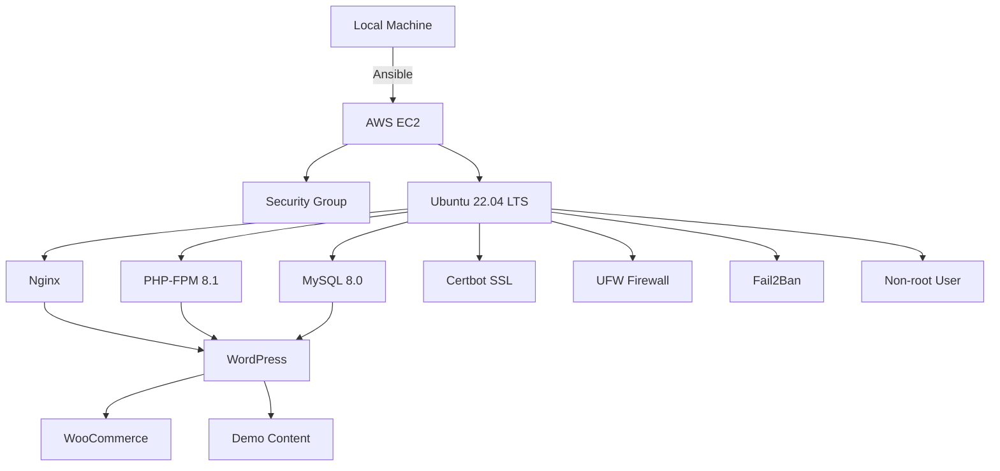

# WordPress on EC2 via Ansible - Professional Deployment Solution

## Project Overview
This repository provides an automated, production-grade solution for deploying WordPress with WooCommerce capabilities on AWS EC2 instances. The infrastructure is provisioned using Terraform/Ansible with a focus on:

- **Infrastructure as Code**: Fully automated provisioning and configuration
- **Security First**: Hardened server configuration from ground up
- **DevOps Best Practices**: Idempotent playbooks, role-based organization
- **Cost Optimization**: Efficient resource utilization on AWS
- **Client-Ready**: Pre-configured with demo content for immediate showcase

## Key Features
### Infrastructure Automation
-  AWS EC2 instance provisioning
-  VPC security group configuration
-  Route53 DNS integration
-  Automatic SSH key management
-  Multi-environment support

### Application Stack
- 🚀 Latest WordPress with WooCommerce
- 🔒 Secure LEMP stack (Nginx, PHP 8.1, MySQL)
- 📦 WP-CLI integration for management
- 🎭 20+ sample products with categories
- 🖼️ Demo content (pages, posts, media)

### Security Hardening
- 🔥 UFW firewall (SSH/HTTP/HTTPS only)
- 👤 Non-root user with sudo privileges
- 🔑 SSH key authentication only
- 🛡️ Fail2ban intrusion prevention
- 🔄 Automatic security updates
- 📈 SSL A+ rating configuration

### DevOps Best Practices
- ♻️ Idempotent playbooks (safe to rerun)
- 🧩 Modular role-based architecture
- 🔍 Detailed logging and output
- ⏱️ Quick deployment (~8-10 minutes)
- 🗑️ Clean resource teardown

## Architecture

